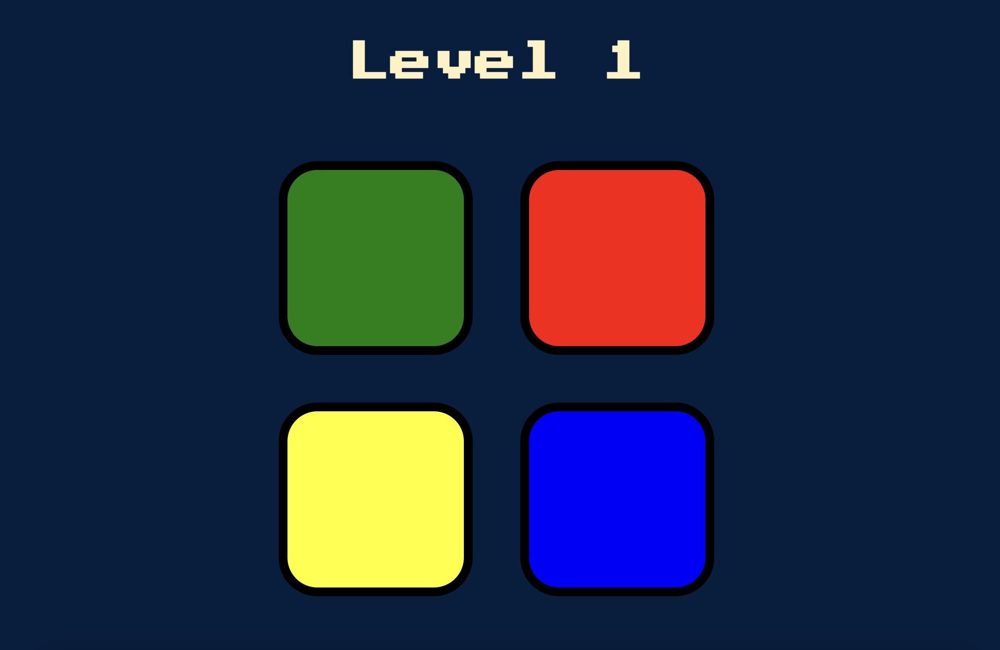

# 🎵 The Simon Game

A **fun and interactive memory game** where players must repeat an increasing sequence of colors and sounds.  
Challenge your memory and see how far you can go!

## 🎮 Live Demo
Play the game here:  
🔗 **[Live Demo](https://kzmaybe.github.io/The-Simon-Game/)**

## 🛠️ Technologies Used
- **HTML** – Structure of the game  
- **CSS** – Styling and animations  
- **JavaScript** – Game logic and event handling  
- **jQuery** – Handling user interactions  

## 🚀 Features
✅ **Dynamic Gameplay** – The sequence gets longer with each level  
✅ **Sound Effects** – Audio feedback for each button press  
✅ **Responsive Design** – Works on desktop and mobile  
✅ **Game Over Animation** – Visual indication when a mistake is made  

## 📜 How to Play
1. Click any key to begin the game.
2. Watch the pattern of lights and sounds.
3. Repeat the sequence by clicking the buttons in the correct order.
4. Each round adds a new step to the sequence.
5. If you make a mistake, the game ends, and you can restart.

